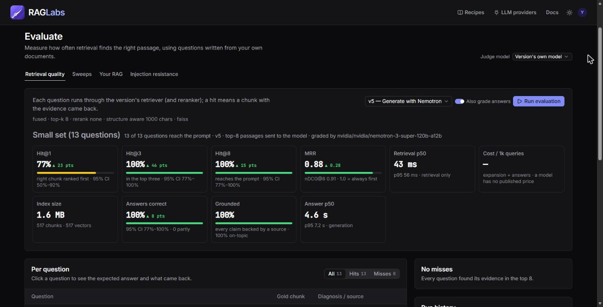
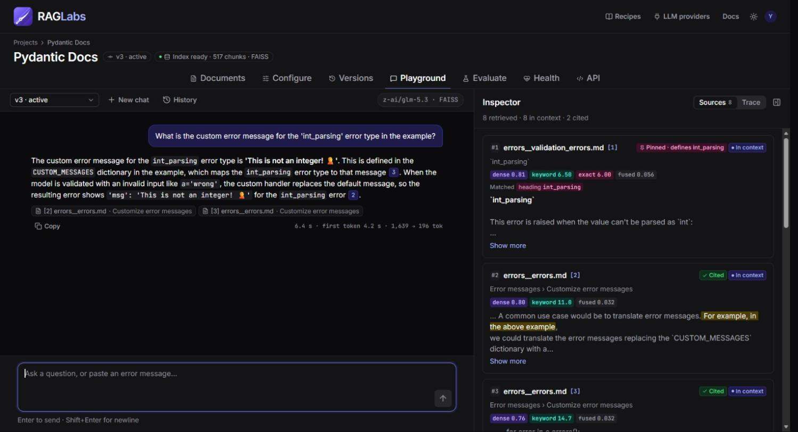
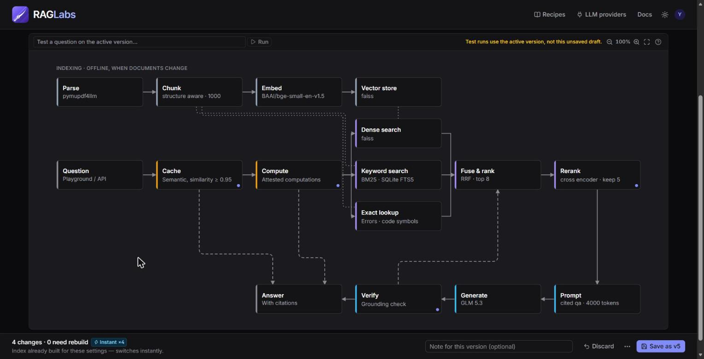

<div align="center">

# RAGLabs

**Build a RAG pipeline from a web UI, then measure why it fails.**

[](https://github.com/anurag-njr11/Rag-Labs/actions/workflows/ci.yml)
[](LICENSE)


[Quick start](#quick-start) · [Features](#features) · [Test a RAG you already have](#test-a-rag-you-already-have) · [Documentation](#documentation) · [Contributing](#contributing)

</div>

Most RAG failures happen before the LLM writes a word: the right passage was never retrieved. RAGLabs lets you
upload documents, choose and tune every stage of the pipeline (including the vector database), chat with cited
answers, and then **score the result**: test questions generated from your own documents, sweeps over settings,
and a diagnosis for every miss. It also scores a RAG you built elsewhere, so you can compare it with a RAGLabs
pipeline on the same questions.

Everything runs on your machine. Documents, indexes and run history stay in a local SQLite database and vector
store; only the LLM calls you configure leave it.

## Features

- **Build** with no code: parse, chunk, embed, store, retrieve, rerank, prompt and generate, each with real options (below). Every saved configuration is an immutable version you can diff and switch back to.
- **Chat and inspect**: streaming answers with citations. An inspector shows which passages were found, by which search path, what was dropped and why, and what each step cost.
- **Evaluate**: one-click eval sets from your documents; Hit@k, MRR, nDCG, tokens and p50/p95 latency, optionally with LLM-graded answers (95% intervals, ties reported as ties). Every miss gets one diagnosis and a suggested fix.
- **Sweep and optimise**: grid over up to 4 settings (chunking, embedder, retriever, top k, reranker, query expansion...). The leaderboard draws the quality-vs-cost frontier, and **Promote** makes the winner live.
- **Corpus Health**: real user questions become a ranked backlog of what your documents can't answer, plus duplicates, contradictions, unused and stale documents.
- **Advanced retrieval and trust**: agentic retrieval and query decomposition, a grounding check that grades every claim and citation, injection-resistance testing, an embedding adapter and prompt optimisation.
- **Bring your own RAG**: score any HTTP RAG endpoint on the same eval set, and gate CI on it.
- **Export** a pipeline as a standalone FastAPI repo, or call it through the project API with scoped API keys.

## Screenshots







### What you can tune

| Stage | Options |
|---|---|
| Parse | PyMuPDF4LLM (Markdown + tables), PyMuPDF (plain text, optional OCR), pypdf |
| Chunk | fixed, recursive, sentence packing, structure-aware (headings), semantic (embedding breakpoints) — size, overlap, unit… Tables are never split. |
| Embed | local fastembed models (bge-small/base, MiniLM, arctic, nomic, mxbai) or Gemini / NVIDIA APIs |
| Vector store | NumPy (exact), FAISS (Flat / IVF / HNSW), Chroma, Qdrant (local mode), LanceDB (none / IVF / PQ / HNSW) |
| Retrieve | dense, keyword (BM25), hybrid, fused (+ exact error-message/code-symbol matching); RRF or weighted fusion, MMR, thresholds; query expansion (multi-query, HyDE); neighbouring-chunk context window |
| Rerank | off, or local cross-encoders |
| Prompt | cited answer, concise, detailed, or your own template; context budget |
| Generate | any OpenAI-compatible LLM: Gemini, NVIDIA, OpenAI, Anthropic, Groq, Mistral, OpenRouter, Together, DeepSeek, Ollama, LM Studio, or your own endpoint (vLLM, LiteLLM, a gateway…); model, temperature, top-p, max tokens |

Every parameter is labelled **⚡ instant** (applies at query time) or **🔁 rebuild** (needs re-indexing). Rebuilds
reuse cached work: switching vector store never re-embeds.

## Quick start

You need an LLM to chat with (retrieval, the inspector and retrieval evaluation work without one): a free
[Gemini](https://aistudio.google.com/apikey) or [NVIDIA](https://build.nvidia.com) key, a key for any other supported
provider, or a local server such as Ollama. Add it in the app under **LLM providers**, or in `.env`.

### Docker

```bash
git clone https://github.com/anurag-njr11/Rag-Labs.git && cd Rag-Labs
docker compose up --build        # http://localhost:8000
```

The compose file publishes the port on `127.0.0.1` only and sets `OPEN_ACCESS=true`: a published port reaches the
app from Docker's gateway (not loopback), and the web UI carries no API key. Don't publish it on a reachable address
without your own auth in front. To serve only API-key callers, drop `OPEN_ACCESS` (the web UI then can't reach the
API from inside Docker). Data, downloaded embedding models and the secret key live on named volumes (`/data`, `/config`).

### From source

Requires [uv](https://docs.astral.sh/uv/) (Python 3.12 is fetched automatically) and Node.js 20+.

```bash
cp .env.example .env          # optional: GEMINI_API_KEY / OPENAI_API_KEY ... (or add keys in the UI)

# terminal 1: backend (http://127.0.0.1:8000)
cd backend && uv sync && uv run uvicorn app.main:app

# terminal 2: frontend (http://localhost:5173)
cd frontend && npm install && npm run dev
```

Seed a demo project (the Pydantic v2 docs, ~500 chunks; the first run downloads a ~70 MB embedding model):

```bash
cd backend && uv run python scripts/seed_demo.py
```

Open the Playground and try *How do I make a field optional with a default?*, or paste a raw error such as
`Input should be a valid integer, unable to parse string as an integer [type=int_parsing, input_value='abc', input_type=str]`
(the top source carries the **exact** badge).

### As a package

`raglabs` is not on PyPI yet. Build the wheel yourself; it ships the web UI:

```bash
cd frontend && npm ci && npm run build      # writes backend/app/web
cd ../backend && uv build --wheel           # dist/raglabs-*.whl
pip install dist/raglabs-*.whl && raglabs serve      # http://127.0.0.1:8000, data in ~/.raglabs (or DATA_DIR)
```

## Test a RAG you already have

Evaluate → **Your RAG** connects any HTTP endpoint (`POST {"question"}` → `{"answer", "contexts": [{"text", "source"}]}`,
with a mappable response) and scores it on the same eval set as your pipelines, so you can see
"your RAG: MRR 0.52, best RAGLabs config: 0.71". The create wizard has an *Evaluate a RAG I already have* path.

### Gate CI on retrieval quality

```bash
raglabs eval --endpoint https://staging.example.com/ask --set eval.csv \
  --header "Authorization: Bearer $RAG_TOKEN" --min-mrr 0.6 --min-hit 0.8
```

`eval.csv` has columns `question`, `evidence` (a verbatim quote that answers it) and optionally `document` (the file
name). Exit code 0 = thresholds met, 1 = missed, 2 = bad input or unreachable. `--json` prints the metrics. In GitHub
Actions, run it from `backend/` as `uv run raglabs eval ...` in a step after `astral-sh/setup-uv`.

## API

Each project exposes `POST /api/projects/{id}/chat`:

```bash
curl -X POST http://127.0.0.1:8000/api/projects/<id>/chat \
  -H "content-type: application/json" \
  -d '{"question": "How do I make a field optional?", "stream": false}'
```

Remote callers need an API key (`Authorization: Bearer rl_...`, created on the project's API tab); requests from this
machine don't. The full contract is in [`frontend/API.md`](frontend/API.md); interactive docs at
http://127.0.0.1:8000/docs.

## Security

- Keys entered in the app are encrypted at rest (AES-256-GCM). The master key is created on first run in your user
  config directory, **not** in `data/`, so a copied database can't be read on its own. Back it up, or supply your own
  via `RAGLABS_SECRET_KEY` (see `.env.example`).
- Keys are never returned by the API (only `…abcd`), are scrubbed from logs, error messages and run history, and are
  never written into exports.
- A stored key is only ever sent to the base URL it was saved with. Changing the URL means re-entering the key.
- The backend only answers to `localhost`/`127.0.0.1` Host headers (`ALLOWED_HOSTS`), which blocks DNS-rebinding
  attacks from web pages.

Please report vulnerabilities privately, as described in [`SECURITY.md`](SECURITY.md).

## Documentation

- The in-app **Docs** (top bar) explain every tab, option and metric. They are Markdown in `frontend/src/features/docs/content/`.
- [`DEVELOPER_ARCHITECTURE.md`](DEVELOPER_ARCHITECTURE.md): how the pipeline, stores, retrieval and evaluation work.
- [`frontend/API.md`](frontend/API.md): the HTTP API contract.

## Project layout

```
backend/app/
  core/          node contract + registry, pipeline validation & index hashing, caches, run records
  nodes/         parse, chunk, embed, retrieve, rerank, prompt, generate node types
  vectorstores/  numpy, faiss, chroma, qdrant, lancedb adapters (one contract, one test suite)
  ingest/        loaders, documents, index builds, exact-match keys, background jobs
  engine/        retrieval, chat, evaluation, store management, sync jobs
  api/           FastAPI routers
frontend/        Vite + React + Tailwind v4 web UI (API.md = backend contract)
data/            created at runtime: app.db, raw files, caches, vector stores (gitignored)
```

## Contributing

Contributions are welcome. [`CONTRIBUTING.md`](CONTRIBUTING.md) covers setup and how to add a node type, vector store
or LLM preset, which are the usual first contributions. Before opening a PR:

```bash
cd backend && uv run pytest -q     # contracts, all vector stores, retrieval, eval, sweeps, corpus health...
cd frontend && npm run build       # type-check + production build
```

## License

[Apache-2.0](LICENSE)
